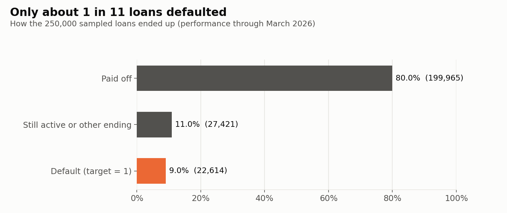
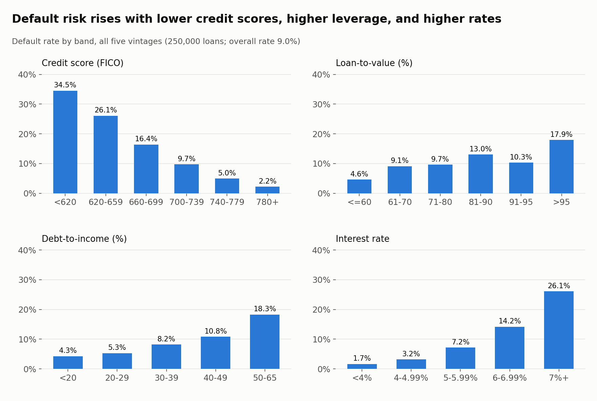
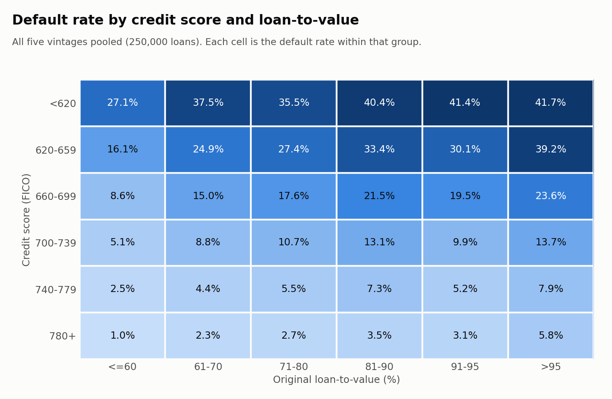
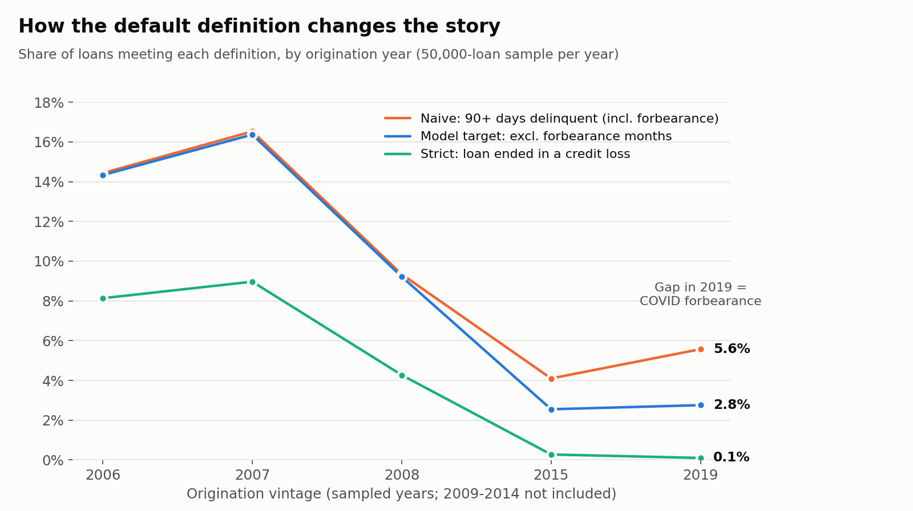
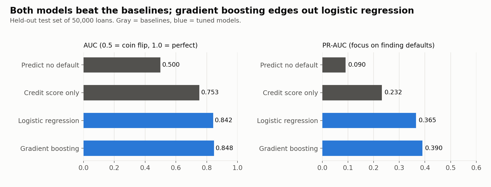
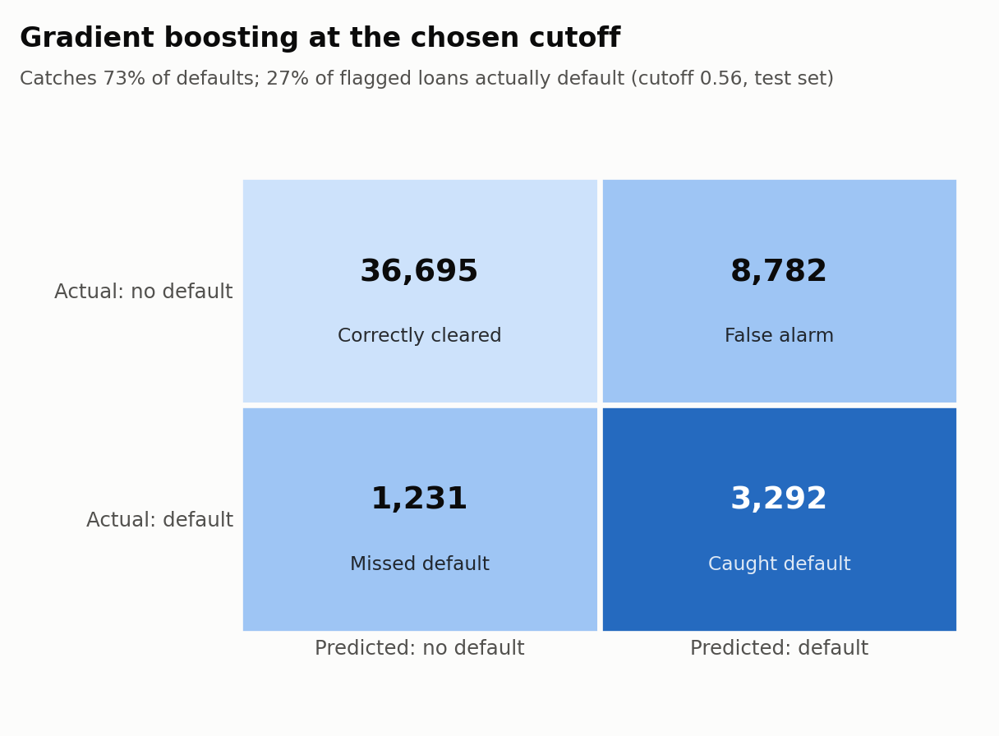
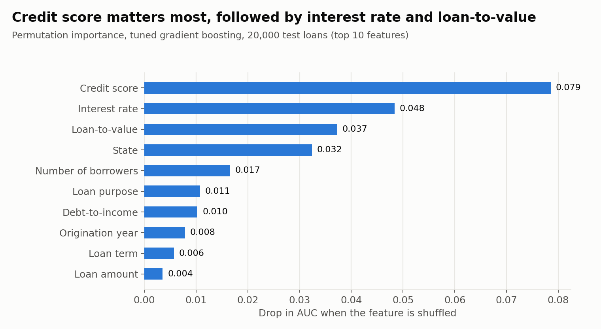
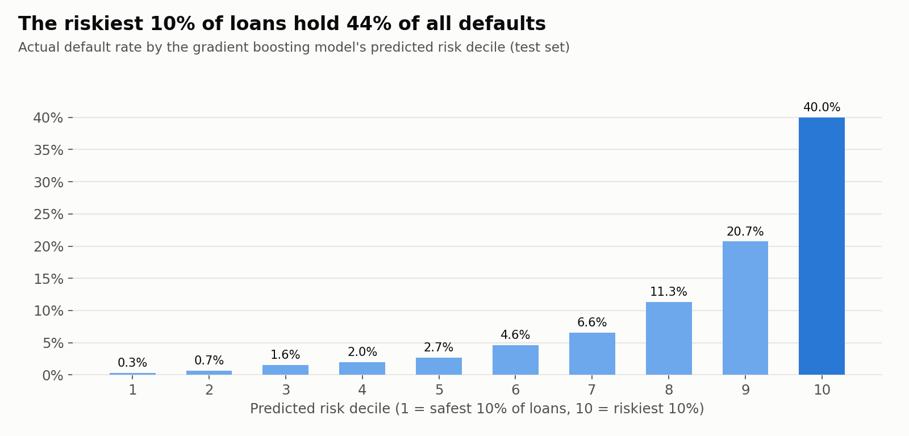
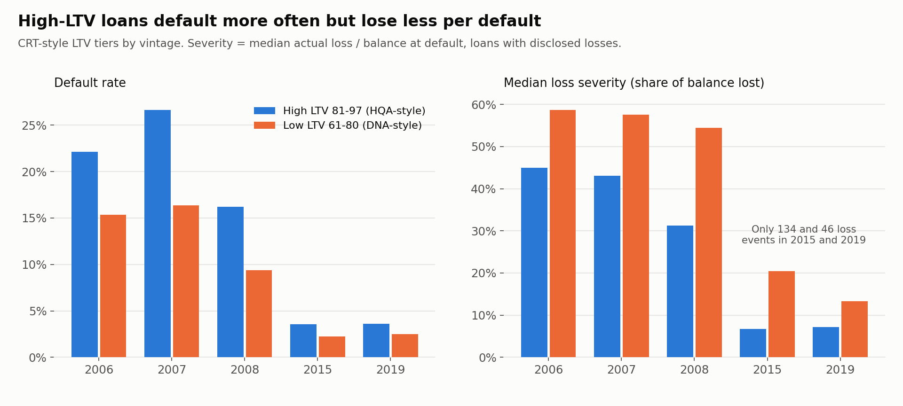

# Predicting Mortgage Default with Freddie Mac Loan Data

*Personal Portfolio Project Two · DTSC 2301 · Rishi · September 2026*

**Code:** [github.com/rishimaroju25/freddie-mac-credit-risk](https://github.com/rishimaroju25/freddie-mac-credit-risk)
**Tools:** Python (pandas, scikit-learn, matplotlib), Tableau

> **In one paragraph:** Using 250,000 real mortgages from Freddie Mac, I built models that predict
> which loans will become seriously delinquent using only information known on the day the loan
> is made. The best model (gradient boosting) ranks loans well: the riskiest 10% of loans contain
> 44% of all defaults. Along the way I found that COVID-era forbearance makes a standard default
> flag overstate 2019 defaults by about 2 times, and that a model trained on crisis-era loans
> loses accuracy on modern loans. The model is useful for portfolio-level risk monitoring, not
> for approving or denying individual borrowers.

---

## 1. Problem Definition

**Prediction problem.** When a mortgage is made, can we predict whether the borrower will
eventually fall seriously behind on payments?

**Target variable.** `default`, equal to 1 if the loan was ever 90 or more days delinquent,
reached foreclosure (REO), or ended in a distressed sale or charge-off, and 0 otherwise. Months
when the borrower was in an approved forbearance plan (for example, COVID payment relief) do not
count toward delinquency. Section 4 explains why.

**Task type.** Binary **classification**.

**Who benefits.** Mortgage investors and guarantors like Freddie Mac, which must hold capital
against expected losses; investors in Freddie Mac's Credit Risk Transfer (CRT) securities, who
take on part of that risk; and servicers, who could reach out earlier to borrowers likely to
struggle.

**Why it matters.** Mortgages are the largest debt most households carry, and the 2008 financial
crisis showed how quickly defaults can spread through the financial system. Freddie Mac publishes
this loan-level data specifically so that outside investors can build better credit models
(Freddie Mac, 2026a).

## 2. Background and Context

Freddie Mac is a government-sponsored enterprise that buys mortgages from lenders, pools them
into securities, and guarantees investors against credit losses. Since 2013 it has shared part
of that risk with private investors through CRT deals, which group loans into tiers by
loan-to-value (LTV) ratio.

Three lines of research shaped this project:

- **Equity matters, but it isn't the whole story.** Foote et al. (2008) found that fewer than
  10% of Massachusetts homeowners who likely had negative equity in the early 1990s lost their
  homes to foreclosure within three years. Owing more than the house is worth raises risk, but
  default usually requires a second shock, such as job loss. This is why I combine LTV with
  credit score, debt-to-income, and other borrower traits instead of relying on any one factor.
- **Relationships are nonlinear, and local economies matter.** Using over 120 million mortgages,
  Sadhwani et al. (2021) showed that deep learning uncovers highly nonlinear relationships between
  loan traits and borrower behavior, and that state unemployment had the greatest explanatory
  power of all their variables. This motivated comparing a linear model with a tree-based model,
  and it flags a gap in my data: no unemployment or house price variables.
- **Better models can be less fair.** Fuster et al. (2022) found that more flexible machine
  learning credit models can widen rate disparities, and that Black and Hispanic borrowers are
  disproportionately less likely to benefit. This shaped the ethics discussion in Section 9.

A fourth source explains the COVID pattern in my data: Cherry et al. (2021) documented that
millions of U.S. mortgages entered forbearance during the pandemic, allowing borrowers to pause
payments without it being treated as a default.

## 3. Data Description

**Source.** Freddie Mac Single-Family Loan-Level Dataset (SFLLD), Standard Dataset sample files,
downloaded from Freddie Mac's Clarity portal in September 2026 (Release 47, performance data
through March 31, 2026). Freddie Mac's full datasets cover roughly 55 million loans (Freddie Mac,
2026b); each sample file is a simple random sample of 50,000 loans from one origination year
(Freddie Mac, 2026a).

**Unit of analysis.** One row = one mortgage. The raw performance file has one row per loan per
month; I rolled those monthly histories up to one outcome per loan.

**Size.** 250,000 loans (50,000 each from 2006, 2007, 2008, 2015, and 2019), built from
14,073,844 monthly performance records.

| Year | Why it's included |
|---|---|
| 2006, 2007 | Housing bubble peak; loans hit the 2008 crash early |
| 2008 | Transition year as lending standards tightened |
| 2015 | Post-crisis lending with about ten years of history |
| 2019 | Pre-pandemic loans, which exposes the effect of COVID forbearance |

**Available features.** The origination file has 31 fields, including credit score, LTV,
combined LTV, debt-to-income (DTI), interest rate, loan amount, term, number of borrowers,
mortgage insurance percentage, loan purpose, occupancy, channel, property type, state, 3-digit
ZIP, metro area, and seller name.

**Missing values** (after converting Freddie Mac's "not available" codes such as 9999 and 999):

| Feature | Missing | Share |
|---|---|---|
| Debt-to-income | 7,270 | 2.9% |
| Credit score | 137 | 0.05% |
| Number of borrowers | 65 | 0.03% |
| Combined LTV | 14 | 0.01% |
| LTV | 12 | 0.005% |
| First-time buyer flag | 49 coded "not available" | 0.02% |
| Metro area | 40,395 blank (non-metro or unknown) | 16.2% |

Most missing DTI values come from 2015 (4,020 loans), where Freddie Mac masks DTI for loans
refinanced through the federal Home Affordable Refinance Program (HARP).

**Restrictions and limitations of the collection.** The Standard Dataset only includes
fully amortizing fixed-rate loans with full documentation. It excludes adjustable-rate loans,
FHA and VA loans, and loans without verified documentation (Freddie Mac, 2026a), so it describes
Freddie Mac's relatively safe conforming market, not all U.S. mortgages. The data has no borrower income, race, ethnicity,
unemployment, or house price information. Freddie Mac also masks some fields for privacy (for
example, only the first three digits of ZIP codes).

## 4. Data Understanding and Exploration

**The target is imbalanced.** Only 9.0% of loans defaulted (22,614 of 250,000). Most loans
(80.0%) were paid off, usually through refinancing or a home sale.

This matters for modeling: a model that predicts "no default" for everyone is 91% accurate and
completely useless. So accuracy is the wrong metric here (see Section 7), and the models use
class weighting so the rare default cases are not drowned out.

**Summary statistics.**

| Feature | Median | Mean | Std. dev. | Min | Max |
|---|---|---|---|---|---|
| Credit score | 748 | 738 | 53 | 300 | 850 |
| LTV (%) | 77 | 72.1 | 17.6 | 5 | 241 |
| DTI (%) | 36 | 35.7 | 11.4 | 1 | 65 |
| Interest rate (%) | 5.88 | 5.41 | 1.18 | 2.35 | 9.79 |
| Loan amount ($) | 185,000 | 208,864 | 114,662 | 9,000 | 1,397,000 |

Defaulted loans looked different at origination: median credit score 691 versus 753, median DTI
41% versus 36%, median rate 6.38% versus 5.75%, and median LTV 80% versus 77%.

**Default risk by feature.** Every major underwriting variable shows a clear, mostly steady
relationship with default:

Credit score shows the strongest pattern (34.5% default under 620 versus 2.2% at 780 and above).
Interest rate is also strong, but part of that is timing: rates were near 6.4% in 2006 and 2007
and near 4% in 2015 and 2019, so rate partly acts as a stand-in for the lending era.

**Credit score and LTV compound each other.** Looking at the two together shows that risk
multiplies when both are bad:

Each percentage is the default rate within its own group of loans, not a share of one total, so
they aren't meant to add up to 100.

**The definition of default changes the story.** The standard flag ("ever 90+ days late") said
2019 loans were riskier than 2015 loans. When I investigated, 87% of those 2019 "defaults" had
been in a forbearance plan, and most later paid off or became current again. Excluding
forbearance months cuts the 2019 rate from 5.6% to 2.8%, in line with 2015, while barely
changing the crisis years.

**Outliers and unusual values.**
- **486 loans have LTV above 100%** (up to 241%). Almost all (484) are from 2015, and nearly all
  of them have DTI masked, which Freddie Mac does for HARP refinances, a program that let
  underwater borrowers refinance. They defaulted at 10.7%, about four times the 2015 average of
  2.5%. I kept them because they are real, high-risk loans, not data errors.
- **56 loans have credit scores below 500.** Rare but valid, so kept.
- **Loss severity has extreme values:** 201 of 9,940 losses are negative (recoveries exceeded the
  balance) and 815 exceed 100% (mostly small balances where interest and expenses exceed the
  loan amount). I summarize severity with medians so these don't distort results.
- **No duplicates:** all 250,000 loan IDs are unique.

**How exploration shaped feature selection.** The clear patterns above confirmed credit score,
LTV, DTI, rate, loan purpose, and number of borrowers as core features. Combined LTV was dropped
because it moves almost in lockstep with LTV (correlation 0.95) and adds little. The big gap between crisis and
modern default rates is why I added origination year as a feature and ran a separate
out-of-time test.

## 5. Data Preparation and Feature Selection

**Building the dataset.**
1. Loaded origination and performance files (pipe-delimited, no headers) using column positions
   from Freddie Mac's user guide, and verified them against the actual values.
2. Processed the 14 million monthly records in 1-million-row chunks to fit in memory, then rolled
   each loan's history into one row: ever 90+ days late, ever in forbearance, how the loan ended,
   and any realized loss.
3. Converted "not available" codes (9999 credit score, 999 LTV and DTI, 99 borrowers) into true
   missing values so they wouldn't be treated as real numbers.

**Missing values.**
- For logistic regression: filled missing numeric values with the training-set median and added
  a "was missing" indicator, so the model can learn if missingness itself signals risk (for
  example, missing DTI flags HARP loans).
- For gradient boosting: left missing values as-is, since the algorithm handles them natively.
- Categories with fewer than 50 loans (like the 49 "not available" first-time buyer codes) were
  grouped into an "infrequent" category.

**Encoding and scaling.** Categorical variables (loan purpose, occupancy, channel, property type,
first-time buyer, state, origination year) were one-hot encoded. For logistic regression, numeric
features were standardized (mean 0, standard deviation 1), which lets coefficients be compared
and helps the solver converge. Gradient boosting doesn't need scaling.

**Features used (15):** credit score, LTV, DTI, interest rate, loan amount, loan term, number of
borrowers, mortgage insurance %, loan purpose, occupancy, channel, property type, first-time buyer,
state, and origination year.

**Features excluded, and why:**

| Excluded | Reason |
|---|---|
| All monthly performance fields | Only known after the loan is made; using them would be data leakage |
| Servicer name | Reflects the servicer in the loan's last reported month, so it leaks future information |
| Combined LTV | Correlation of 0.95 with LTV, so nearly redundant |
| Metro area | 16% blank and hundreds of categories; state already captures geography |
| 3-digit ZIP | Very high cardinality, and fine-grained geography can act as a proxy for race and ethnicity |
| Seller name | Small sellers are lumped into "Other," and seller names change over time |
| Number of units | 97.7% of loans are single-unit, so it carries almost no information |
| HARP flag, special program flags | Only exist for some years, so they would behave inconsistently across vintages |
| VantageScore 4.0 | Not populated for any loan in these samples |

**Train and test split.** A stratified random 80/20 split: 200,000 loans for training and
50,000 for testing, with the same 9.0% default rate in each. The test set was used only once, for
the final evaluation.

**Preventing data leakage.**
- Only origination-time information is used as features.
- All imputation, scaling, and encoding steps sit inside scikit-learn pipelines, so they are fit
  on training data only (and only on the training folds during cross-validation).
- Hyperparameters were tuned with cross-validation on the training set, never the test set.
- The decision cutoff (Section 7) was chosen on a validation slice of the training set.
- A separate out-of-time test trains only on 2006 to 2008 loans and scores 2015 and 2019 loans,
  mimicking how a model would be used on future loans.

## 6. Baseline and Model Development

**Baselines.**
1. **Predict "no default" for everyone.** Shows what accuracy looks like with zero skill
   (91% accuracy, 0% of defaults caught).
2. **Credit score only** (logistic regression on one variable). This is the realistic bar,
   because credit score is the single most common screening tool. Any model worth using should
   clearly beat it.

**Models.**
1. **Logistic regression.** Estimates how each feature raises or lowers the odds of default. It
   is transparent and is the traditional standard in credit scoring, which matters in a
   regulated industry.
2. **Gradient boosting** (scikit-learn's histogram-based version). Builds hundreds of small
   decision trees, each correcting the previous ones' mistakes. It captures nonlinear effects
   and interactions (like credit score and LTV compounding), which the research above suggests
   matter.

Both use balanced class weights so defaults count as much as non-defaults in training.

**Hyperparameter tuning.** 3-fold stratified cross-validation on the training set, scored by AUC:
- Logistic regression: regularization strength C in {0.01, 0.1, 1, 10}. Best: C = 0.1
  (CV AUC 0.841). All values within 0.001 of each other, so the model is not sensitive to C.
- Gradient boosting: randomized search over 10 combinations of learning rate, tree size, minimum
  leaf size, and L2 regularization, with early stopping. Best: learning rate 0.05, 63 leaves,
  minimum 100 loans per leaf, L2 = 5 (CV AUC 0.848).

**Fair comparison.** Both models used the same features, the same training loans, the same
cross-validation folds, the same tuning metric, and the same untouched test set.

## 7. Model Evaluation and Selection

**Metrics, and why these ones.**
- **AUC (ROC):** the chance that the model ranks a randomly chosen defaulted loan as riskier than
  a randomly chosen healthy loan. 0.5 is a coin flip; 1.0 is perfect. It measures ranking, which
  is what a risk team needs.
- **PR-AUC (average precision):** focuses only on how well the model finds the rare defaults
  without too many false alarms. With a 9% default rate, random guessing scores 0.09, so it is a
  tougher and more honest measure than accuracy.
- **Recall and precision at a cutoff:** recall is the share of actual defaults the model catches;
  precision is the share of flagged loans that actually default.

**Results on the 50,000-loan test set:**

| Model | AUC | PR-AUC |
|---|---|---|
| Baseline: predict no default | 0.500 | 0.090 |
| Baseline: credit score only | 0.753 | 0.232 |
| Logistic regression (tuned) | 0.842 | 0.365 |
| **Gradient boosting (tuned)** | **0.848** | **0.390** |

**Final model: gradient boosting.** It beat both baselines by a wide margin and edged out
logistic regression on both metrics. To check the gap wasn't luck, I bootstrapped the test set
300 times: gradient boosting's AUC advantage averaged 0.0055, with a 95% interval of 0.0034 to
0.0075, which never crosses zero. The gain is real but small. It likely comes from capturing
interactions, like credit score and LTV compounding, that a linear model can only approximate.

**The tradeoff.** Logistic regression is nearly as accurate and far easier to explain to
regulators and borrowers. In a real lending decision, that transparency might be worth giving up
the small accuracy gain. For portfolio risk monitoring, where ranking matters most, gradient
boosting is the better choice.

**Choosing a cutoff.** The model outputs a risk score from 0 to 1, and a cutoff turns scores into
"flag" or "don't flag." Missing a default is usually more costly than a false alarm, so I chose
the cutoff that maximizes the F2 score, which weights recall twice as heavily as precision. The
cutoff (0.56) was chosen on a slice of the training data, not the test set.

At that cutoff the model flags 24% of loans, catches 73% of defaults (3,292 of 4,523), and 27% of
flagged loans actually default, three times the 9% base rate. The defaults it catches account for
86% of the dollar losses among test-set defaults ($151.7 million caught versus $24.7 million
missed), because the loans it misses are less likely to end in an actual loss.

**Out-of-time check.** A model trained only on 2006 to 2008 loans scored an AUC of about 0.72 to
0.73 on 2015 and 2019 loans (both models), well below the 0.85 from the random split. This is the
more realistic estimate of how a model built on past data performs on new loans.

## 8. Model Interpretation and Insights

**What the model learned.**

Permutation importance (how much AUC drops when one feature is scrambled) ranks credit score
first, then interest rate, LTV, and state. The logistic regression coefficients tell the same
story in plain terms, holding other features constant:
- Each 53-point increase in credit score (one standard deviation) roughly **halves** the odds
  of default (odds ratio 0.49).
- Each 18-point increase in LTV raises the odds by about **70%** (odds ratio 1.70).
- Each 1.2-point increase in interest rate raises the odds by about **38%** (odds ratio 1.38).
- Each 11-point increase in DTI raises the odds by about **28%** (odds ratio 1.28).
- Going from one borrower to two roughly **halves** the odds (this is about two standard
  deviations, so the odds ratio is 0.69 × 0.69 ≈ 0.48), likely because two incomes provide a
  cushion.
- Nevada, Florida, and Arizona had the highest-risk state effects, all markets where house prices
  fell sharply after 2006. My data has no house price information, so this is a likely
  explanation, not a tested one.

**Where the model performs well: ranking.**

Sorting test loans by predicted risk, the safest 10% defaulted at 0.3% and the riskiest 10% at
40.0%. The top 10% of loans hold 44% of all defaults, and the top 20% hold 67%.

**Where it performs poorly.**
- **Modern loans.** At the chosen cutoff, the model catches 82% to 86% of 2006 and 2007 defaults
  but only 12% to 13% of 2015 and 2019 defaults. It still ranks modern loans reasonably well
  (AUC 0.75 to 0.78 within those years), but one cutoff learned mostly from crisis-era defaults
  flags very few modern loans. In practice, a lender would need a separate cutoff for each era.
- **Low credit scores.** Within the under-620 group, AUC is only 0.68, because nearly all of
  these loans look risky and the model struggles to tell them apart.
- **The loans it misses** have a median credit score of 735 (versus 675 for defaults it catches),
  are more often home purchases (51% versus 35%), and more often come from 2015 or 2019. They
  look like good loans at origination. Their defaults were likely driven by events after the
  loan was made, such as job loss, which origination data cannot see.

**Example predictions** (test set):

| Risk rank | Score | Credit score | LTV | DTI | Rate | Purpose | Year | Actually defaulted? |
|---|---|---|---|---|---|---|---|---|
| 5th percentile | 0.02 | 769 | 63 | 22 | 5.50% | Refinance (no cash-out) | 2008 | No |
| 50th percentile | 0.25 | 755 | 78 | 44 | 4.00% | Cash-out refinance | 2015 | No |
| 99th percentile | 0.92 | 636 | 92 | 37 | 7.13% | Refinance (no cash-out) | 2007 | Yes |

**What can and can't be concluded.** The model shows which origination traits are associated
with default in Freddie Mac's conforming loans. It does not show that any trait *causes* default.
Its scores are also **not literal probabilities**: because of class weighting, a score of 0.85
corresponds to an actual default rate of about 40% in the top decile. The scores are meaningful
for ranking, not as "this loan has an 85% chance of default."

**A related finding on losses.** High-LTV loans (81 to 97) defaulted more often than 61 to 80
LTV loans but lost less per default (for 2007 loans, 27% versus 16% default rate, but 43% versus
58% median loss severity). This is consistent with mortgage insurance absorbing part of the loss:
Freddie Mac generally requires it above 80% LTV, and 97% of such loans in this sample carry it.

## 9. Limitations, Ethics, and Reflection

**Biases and gaps in the data.**
- **Selection bias.** The data only includes loans Freddie Mac bought: fixed-rate, fully
  documented, conforming loans. Borrowers who were denied, or who used FHA, VA, or subprime
  loans, are missing. Those groups may differ systematically by income and race from the
  borrowers in the data, so the model says little about them.
- **No demographic data.** Without race or ethnicity fields, I cannot test whether the model's
  errors fall unevenly on protected groups. State (and ZIP, which I excluded) can correlate with
  race, and Fuster et al. (2022) show that flexible ML models can widen disparities even without
  using race directly.
- **Missing economic drivers.** No unemployment, income changes, or house prices, which
  research identifies as major default drivers (Sadhwani et al., 2021).
- **Era dependence.** Five sampled years, dominated by crisis-era defaults; 2009 to 2014 are
  not included.

**Who is affected by errors, and how.**
- **False negatives (missed defaults)** fall on investors, Freddie Mac, and ultimately
  taxpayers, through unexpected losses and undersized capital reserves. Borrowers are hurt too:
  a missed warning sign means no early outreach before they fall behind.
- **False positives (false alarms)**, if the model were used to approve loans, would mean
  qualified borrowers being denied or charged more. At the chosen cutoff there are 8,782 false
  alarms for 3,292 caught defaults, and because the model leans on credit score, those errors
  would fall hardest on borrowers with thinner credit histories.

**Would I use this for real decisions?** For portfolio-level monitoring (estimating how risky a
pool of loans is, or comparing CRT tiers) it is reasonable, with regular recalibration. For
approving or pricing individual loans, **no**. It hasn't been tested for fair lending compliance,
its scores aren't calibrated probabilities, and its cutoff doesn't transfer across lending eras.

**What users should understand before relying on it.** Scores rank risk; they are not
probabilities. Performance drops on loans from a different era than the training data. And the
model only reflects Freddie Mac's conforming market through March 2026.

**Next steps.**
- Add house price and state unemployment data to capture what happens after origination.
- Add the 2009 to 2014 vintages and calibrate scores (for example, with isotonic regression) so
  they can be read as probabilities.
- Model loss severity directly and combine it with default probability into expected loss.
- Test SHAP values for per-loan explanations, and set era-specific cutoffs.

## 10. Code and Transparency

**Code.** Everything is reproducible from the GitHub repository:
[github.com/rishimaroju25/freddie-mac-credit-risk](https://github.com/rishimaroju25/freddie-mac-credit-risk).
`src/run_analysis.py` builds the dataset and core models, `src/model_evaluation.py` runs the
baselines, tuning, and evaluation in this post, and `src/make_figures.py` draws every chart.
Raw data is not included because Freddie Mac's terms restrict redistribution; the repository
explains how to download it for free.

**Data and documentation.** Freddie Mac Single-Family Loan-Level Dataset (Freddie Mac, 2026b) and
its user guide (Freddie Mac, 2026a),
used under Freddie Mac's terms and conditions. Only aggregated results are published. Freddie
Mac does not endorse this analysis.

### References

Cherry, S., Jiang, E. X., Matvos, G., Piskorski, T., & Seru, A. (2021). Government and private
household debt relief during COVID-19. *Brookings Papers on Economic Activity*, 2021(Fall),
141–199. https://www.brookings.edu/articles/government-and-private-household-debt-relief-during-covid-19/

Foote, C. L., Gerardi, K., & Willen, P. S. (2008). Negative equity and foreclosure: Theory and
evidence. *Journal of Urban Economics, 64*(2), 234–245.
https://www.sciencedirect.com/science/article/abs/pii/S0094119008000673

Freddie Mac. (2026a). *Single-Family Loan-Level Dataset general user guide* (July 2026).
https://www.freddiemac.com/fmac-resources/research/pdf/general_user_guide_july_2026.pdf

Freddie Mac. (2026b). *Single-Family Loan-Level Dataset* [Data set, Release 47].
https://www.freddiemac.com/research/datasets/sf-loanlevel-dataset

Fuster, A., Goldsmith-Pinkham, P., Ramadorai, T., & Walther, A. (2022). Predictably unequal? The
effects of machine learning on credit markets. *The Journal of Finance, 77*(1), 5–47.
https://doi.org/10.1111/jofi.13090

Sadhwani, A., Giesecke, K., & Sirignano, J. (2021). Deep learning for mortgage risk. *Journal of
Financial Econometrics, 19*(2), 313–368. https://doi.org/10.1093/jjfinec/nbaa025

### AI Usage Disclosure

I used **Claude** (Anthropic), accessed through the Claude app. The session was configured to use
the model **Claude Opus 5.5**, though the underlying model serving a given response can differ
from the configured one. I used it between September 23 and September 28, 2026, for:

- **Project design:** comparing Freddie Mac's CRT, MBS, and loan-level datasets and choosing the
  research question, target definition, and vintages.
- **Code:** writing and running the Python pipeline, models, tuning, evaluation, and chart code.
- **Analysis:** identifying the COVID forbearance issue and the out-of-time performance drop, and
  catching and fixing a credit-score banding error.
- **Research:** finding and verifying the references above.
- **Writing:** drafting this post and the repository README.
- **Visualization:** step-by-step guidance for building the Tableau charts, which I built myself.

I reviewed the results, asked follow-up questions to understand each modeling decision, checked
the outputs, and made the final decisions about what to include.
